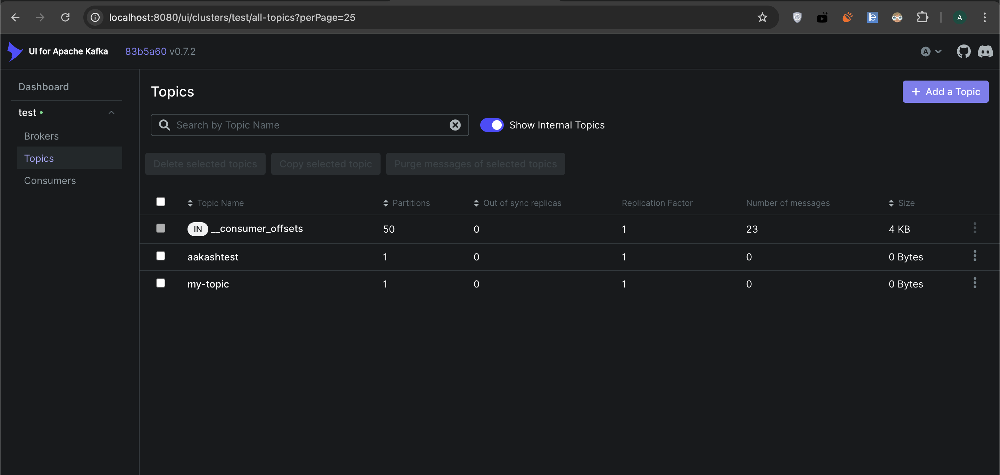

# Kafka Docker Project

This is a basic setup of Apache Kafka and Zookeeper using Docker.

## 🚀 How to Start the Kafka Application

### 1) Run this Docker command to run the docker 

```bash
docker-compose up -d
```

### 2) Run this command to start kafka ui 

```bash
docker run -it -p 8080:8080 -e DYNAMIC_CONFIG_ENABLED=true provectuslabs/kafka-ui
```
### 3) Verify using the containers are running using

```
docker ps
```
It should look like this: 

| CONTAINER ID | IMAGE                    | COMMAND                     | CREATED    | STATUS       | PORTS                    | NAMES        |
|--------------|--------------------------|-----------------------------|------------|--------------|--------------------------|--------------|
| d53e83c5eb87 | bitnami/kafka:latest     | /opt/bitnami/scripts/...    | 2 days ago | Up 52 seconds| 0.0.0.0:9092->9092/tcp   | kafka        |
| 0bbf4468c846 | provectuslabs/kafka-ui   | /bin/sh -c 'java --...      | 2 days ago | Up 52 seconds| 0.0.0.0:8080->8080/tcp   | crazy_volhard|


### 4) Go to localhost:8080 and put this in brokers:

```
host.docker.internal:9092
```

### 5) Now you should be connected to your kafka Cluster

